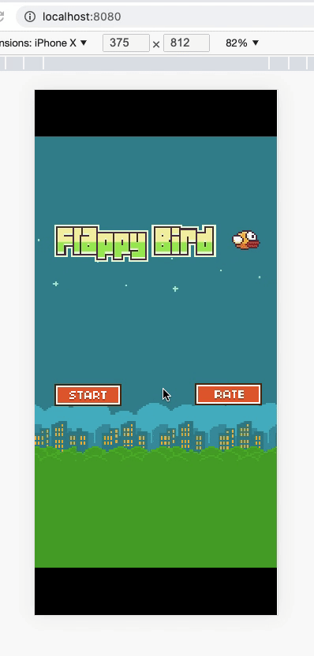

FlappyBird
===============

A Flappy Bird Clone made using [phaser 3](https://phaser.io/phaser3)


Setup (as tested on MacOS)
---------------------------

1. Install Nodejs from [here](https://nodejs.dev/download)

2. Clone the repository:

   ```bash
   $ git clone https://github.com/PhamMinhHaiAu-12035071/phaser3-flappy-bird.git
   ```

   or download as zip and extract.

3. In the root directory run

   ```bash
   $ npm install
   ```
4. Start the local development server (on port 8080)
   ```bash
   $ npm start
   ```
5. Ready for production? Build the production ready code to the /dist folder
   ```bash
   $ npm run build
   ```
6. Play your production ready game in the browser
   ```bash
   $ npm run build
   ```
7. Use `Mouse` </kbd> or <kbd>Space</kbd> key to play


Notable forks
-------------

- [Template phaser 3 and typescript](https://github.com/yandeu/phaser-project-template)
- Made something awesome from FlapPyBird? Add it to the list :)


Demo
----------


